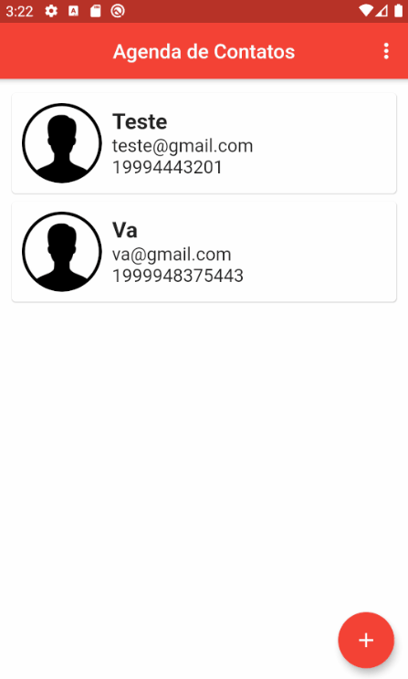
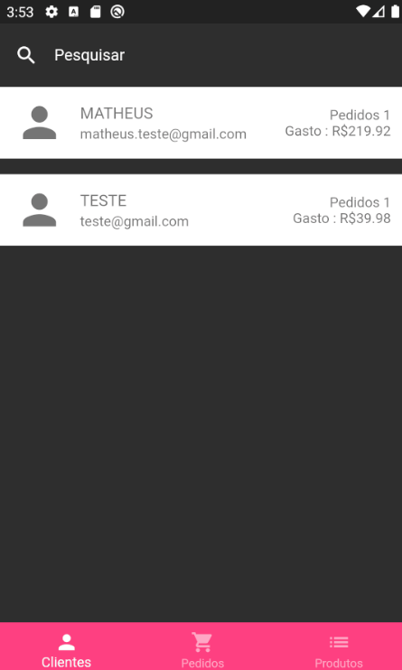

# Projetos-flutter
Esses são alguns projetos desenvolvidos no curso do Daniel Cioffi(https://www.udemy.com/course/curso-completo-flutter-app-android-ios/)

Exemplos dos Apps logo abaixo:

Loja Virtual

Agenda de Contatos

Fluttertube

Gerente da Loja

